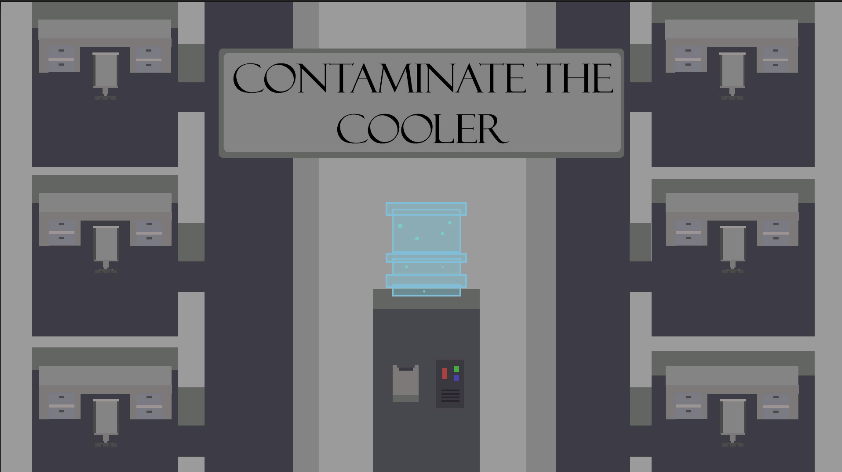
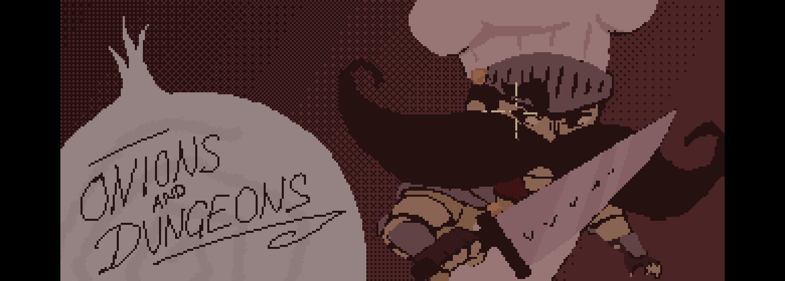
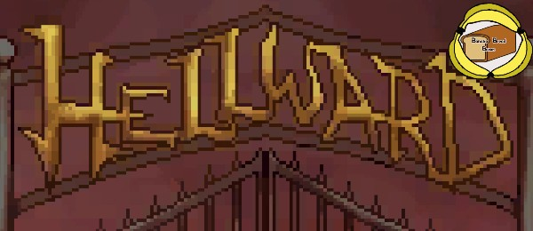
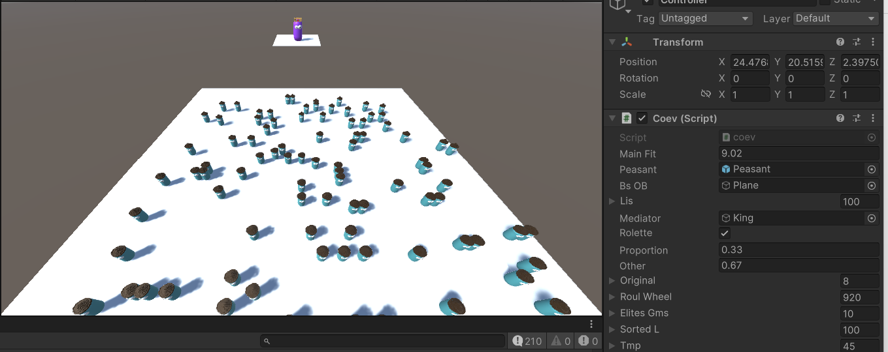

## MiniJam 159 Entry: Contaminate the cooler
Jam theme: Ocean, Constraint: As small as possible. 
- 
- Tags: Category 1
- Badges:
  - Game [green]
- Buttons:
  - itch.io [https://dr-kend.itch.io/contaminate-the-cooler]

## Slumbr
Turn based action game set on a grid, play strategically avoid the goop patterns placed by enemies and traverse the levels to face the boss! I'm responsible for most of the programming within the game. 
- 
- Tags: Category 1
- Badges:
  - Game [green]
- Buttons:
  - itch.io [https://ghost-wyvern.itch.io/slumber]

## Onions and Dungeons
Onions and Dungeons is a top-down dungeon crawler. The player must explore the lich’s dungeon killing enemies, solving minigames and finally encountering the lich and beating him in a cook off.
- 
- Tags: Category 1
- Badges:
  - Game [green]
- Buttons:
  - itch.io [https://onions-and-dungeons.itch.io/onions-and-dungeons]

## Hellward
Hellward is a 3D Tower Defense game set in a Hellish landscape in the midst of a war between Angels and Devils. You play as the Archdevil, protecting your land in the last stand against the invading army of angels.
- 
- Tags: Category 1
- Badges:
  - Game [green]
- Buttons:
  - itch.io [https://joshleighdev.itch.io/hellward]

## Simple 8 bit genetic algorithm 
A simple 'open top' genetic algorithm I created for my COMP 280 project at the end of my second year at falmouth university. All code was written by myself, nothing ground breaking - but I'm proud of it.
- 
- Tags: Other
- Badges:
  - Project [green]
- Buttons:
  - github [https://github.com/20Whey/8-bit-genetic-alg]